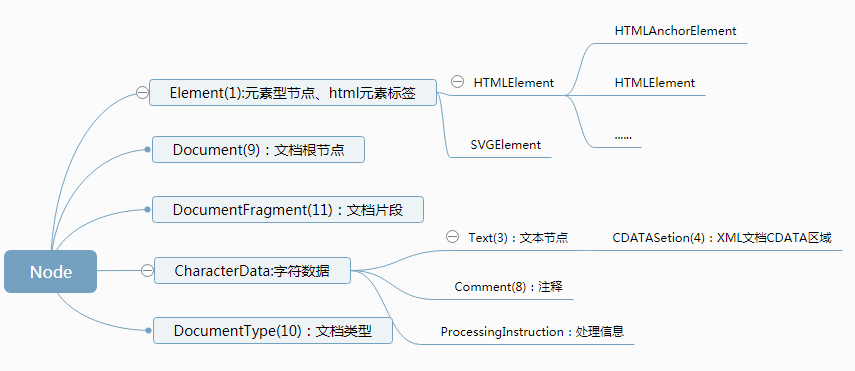

# DOM(文档对象模型)

> 是html和xml文档的一个API，dom描绘了一个层次化的节点树，对页面进行查找、添加、删除和修改。

## DOM API大致分4个部分

- 节点：DOM树形结构中的节点相关
- 事件：触发和监听事件
- Range：操作文字范围
- 遍历：遍历DOM

### 节点

DOM树形结构所有的节点有统一的接口Node，节点类型

### Node

Node是所有节点类型都继承Node类型，因此所以节点都共享这相同的基本属性和方法。
Node提供了一组属性来表示在DOM树中的关系，它们是：

- parentNode
- childNodes
- firstChild
- lastChild
- nextSibling
- previousSibling

这组属性提供了父子前后关系，我们可以根据相对位置获取元素。Node也提供了操作DOM树的API：

- appendChild(node)
- insertBefore(node, child)
- removeChild(child)
- replaceChild(node, child)

Node还提供了一些高级API：

- compareDocumentPosition(node):number 比较两个节点中关系的函数
- contains(otherNode)  返回的是一个布尔值，来表示传入的节点是否为该节点的后代节点
- isEqualNode(otherNode) 检查两个节点是否完全相同
- isSameNode 检查两个节点是否是同一个节点，实际上在JavaScript中可以用“===”
- cloneNode 复制一个节点，如果传入参数true，则会连同子元素做深拷贝
- normalize 将当前节点和它的后代节点”规范化“（normalized）。在一个"规范化"后的DOM树中，不存在一个空的文本节点，或者两个相邻的文本节点。

DOM标准规定了节点必须从文档的create方法创建，document创建各种类型节点有这些方法：

- createElement
- createTextNode
- createCDATASection
- createComment
- createProcessingInstruction
- createDocumentFragment
- createDocumentType

### Element 与 Attribute

- getAttribute
- setAttribute
- removeAttribute
- hasAttribute

追求极致性能还可以把Attribute当作节点

- getAttributeNode
- setAttributeNode

## 查找元素

- querySelector
- querySelectorAll
- queryElementById
- queryElementByName
- queryElementByTagName
- queryElementByClassName

